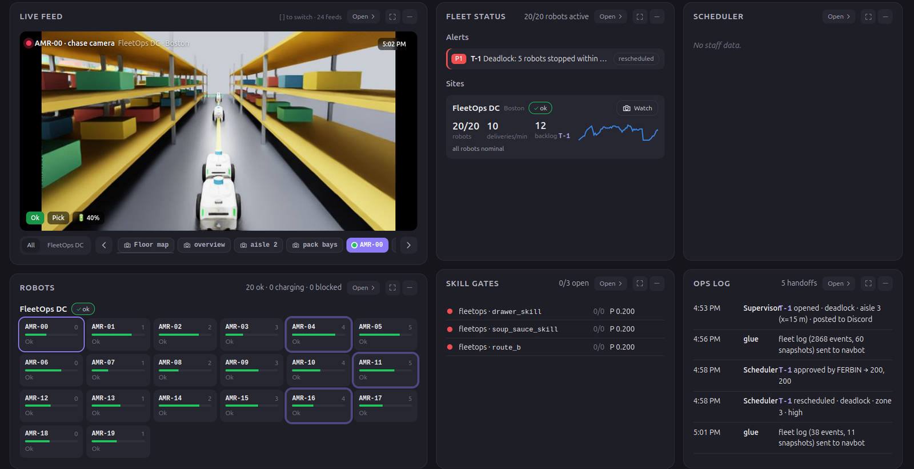
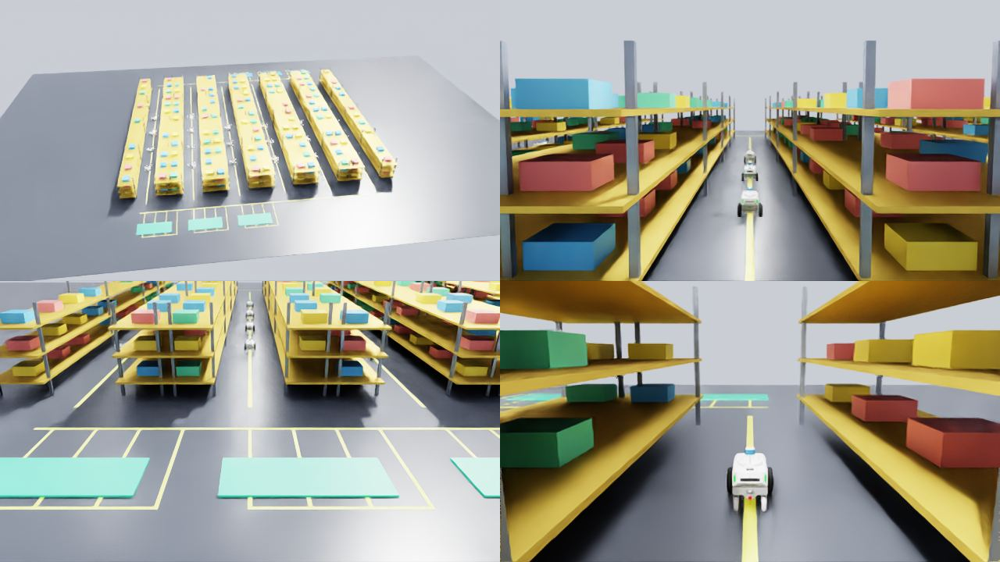

# FleetOps

<p align="left">
  
  
  
  
  
  
  
</p>

**A warehouse robot fleet run by two local LLMs, on one desk-side box**

Twenty NVIDIA Nova Carter robots work a warehouse in Isaac Sim. When one of them jams, overheats, runs low,
or a shelf comes up short, a **supervisor LLM** notices, works out the root cause (the robot that stopped
first, not the five queued behind it) and opens a ticket. A **scheduler LLM** turns that ticket into a
plain-English card in Discord, where the person on shift approves the fix with one ✅. A live command center
shows the whole fleet, the tickets, and real camera video from inside the sim, down to a chase camera on
any single robot.

All of it, the simulator, both models, the agents, the dashboard and the bot, runs on a single
Dell Pro Max GB10. No model call leaves the box.

**Built for:** Dell × NVIDIA GB10 Hackathon, 2026-10-03, Hult International Business School, Cambridge MA

<p align="center">
  
</p>

---

## Snapshot

- **Real Isaac Sim, on the GB10:** 20 Nova Carters on aarch64, one-way traffic, junction locks,
  drive-through pack bays, red fault beacons over any robot in trouble
- **Two local LLMs, one model server:** Qwen3.6-35B-A3B (NVFP4) on vLLM serves both the supervisor
  agent and the scheduler bot
- **Supervisor agent in a sandbox:** an OpenClaw agent inside a NemoClaw sandbox, with 11 tools over the
  live fleet (state, robots, inventory, events, tickets, trust, commissioning) and thinking turned on
- **Discord as the control room:** incidents land in `#red-room` with an LLM debrief, decisions land in
  `#approvals`, and a ✅ or ❌ flows straight back into the ticket
- **Live command center:** switch between the floor map and real Isaac video, step through 24 feeds,
  click any robot for its chase camera with status, task and battery on top
- **Code enforces, models explain:** detection, spacing, locks, ticket states and the commissioning gate
  are computed in code; the LLMs decide what to say, what to escalate and to whom
- **One command to deploy:** six services in one Docker image, health-checked, restarting on their own

## Screenshots

<p align="center">
  <br/>
  <sub>The submission, as it runs: Isaac Sim and the command center side by side on the GB10's own screen.</sub>
</p>

<table>
  <tr>
    <td width="50%"></td>
    <td width="50%"></td>
  </tr>
  <tr>
    <td><sub>Command center: AMR-00's chase camera, live from Isaac, with its status on the frame.</sub></td>
    <td><sub>Fixed cameras: overview, aisle and pack bays, plus a chase camera for every robot.</sub></td>
  </tr>
</table>

<p align="center">
  <br/>
  <sub>Tickets written by the supervisor LLM: a deadlock is traced back to the robot that stopped first.</sub>
</p>

## Built With


## What It Does

### For the people on shift
- Watch the whole floor at a glance: robots, batteries, deliveries per minute, open tickets
- Flip the live feed between the floor map and real camera video from the sim, or open any robot's
  own chase camera
- Read incidents as plain English, not error codes: what broke, which orders are at risk, what to do
- Approve or reject a fix from Discord with one reaction, and see the ticket move to `rescheduled`

### Behind the scenes
- **Fleet logic** (`fleetops/sim/fleet.py`, pure Python): Dijkstra routing on a one-way loop, junction
  locks, slot reservations, a holding loop, drive-through bays, inventory with shrink and restock
- **Detectors** in the supervisor service flag stuck robots after 2 s, deadlock clusters, drive faults,
  overheating, low battery and inventory mismatches, and excuse robots that are only yielding
- **The supervisor LLM** is woken by a webhook, pulls what it needs through its tools, and opens one
  ticket per root cause instead of one per symptom
- **The glue** forwards each new ticket to navbot as `TASK_FAILED` (plus `APPROVAL_REQUEST` when the fix
  changes the schedule) and serves the dashboard's live sources
- **navbot** has its own LLM write the debrief and headline, posts the cards, and sends approvals back
- **Commissioning gate:** a new robot skill only goes live when a Thompson-sampling bandit is 95% sure its
  success rate is at least 80%

## How It Fits Together

```
 Isaac Sim (GB10 screen) ──push──> sim bridge :3001 ──> supervisor tools :8090 ──ticket──> glue :7100
   20 Nova Carters, cameras :8212        │                 detectors, tickets,              │      │
                                         │                 trust gate                       │      └─> navbot :8787 ─> Discord
                                         │                    │                             │          #red-room  #approvals
                                         │                    └─wake─> SUPERVISOR LLM       │          ✅ / ❌ back to the ticket
                                         │                             OpenClaw in NemoClaw │
                                         └────────────────────────────────────────────────> dashboard :8095
                                                                                             map, live video, tickets

 Both LLMs: Qwen3.6-35B-A3B NVFP4 on vLLM :8000, on the same GB10
```

## Measured on the GB10

| Step | Time |
|---|---|
| Fault injected → detected by the supervisor service | **2 to 3 s** |
| → supervisor LLM opens a root-cause ticket | **15 to 94 s** (longer when it reasons through a jam) |
| → ticket on the dashboard | immediate |
| → cards in `#red-room` and `#approvals` | **about 4 s** |
| navbot debrief / headline from the scheduler LLM | **0.4 to 0.9 s** |
| Traffic test: 30 sim-minutes × 3 seeds | **0 robot overlaps** |

Every row above comes from `fleetops/tools/e2e.sh` or `fleetops/sim/test_fleet.py` run on the box.

## App Map

```
navfix/
  fleetops/                  Integration: sim, Isaac, glue, deployment
    sim/fleet.py               Fleet logic: routing, traffic, locks, inventory, faults
    sim/sim_bridge.py          Telemetry, events and demo-fault queue (:3001)
    sim/fleet_runner.py        Headless sim for when Isaac is closed
    isaac/warehouse_live.py    Isaac Sim warehouse, 20 Nova Carters, MJPEG cameras (:8212)
    glue/fleetops_glue.py      Dashboard sources + ticket forwarding to navbot (:7100)
    docker/                    One image, six services, compose with health checks
    fleetops.sh                start | stop | status | isaac | headless | reset-demo | build
    tools/                     e2e.sh, ask_agent.sh, screen_layout.py, read_card.py
  supervisor/                Supervisor tool service (:8090), OpenClaw skill, bandit gate
  navbot/                    Discord bot + scheduler LLM (:8787), see navbot/README.md
  dashboard/                 Fleet & Field command center (:8095), see dashboard/README.md
  docs/img/                  Screenshots used here
```

## Getting Started

### Prerequisites
- A Dell Pro Max GB10 (or DGX Spark) with Docker and the NVIDIA container runtime
- vLLM serving `nvidia/Qwen3.6-35B-A3B-NVFP4` on port 8000
- A NemoClaw sandbox running the OpenClaw gateway, with the skill in `supervisor/openclaw/`
- Isaac Sim 6.0 (pip, aarch64) in `~/isaacsim-env`
- A Discord bot token and channel ids in `navbot/.env` (see `navbot/.env.example`)

### Run
```bash
cd fleetops
./fleetops.sh start                # model check, six containers in order, agent check
./fleetops.sh isaac                # Isaac Sim on the screen becomes the live sim
python3 tools/screen_layout.py     # Isaac left, command center right
./fleetops.sh status
```

### Try a fault
```bash
tools/e2e.sh stuck                 # inject, then time detection -> ticket -> dashboard -> Discord
tools/ask_agent.sh "Which robots are waiting for traffic, and why?"
```

Full deployment notes are in [`fleetops/README.md`](./fleetops/README.md).

## Team

| | |
|---|---|
| **Ferbin** | Integration: Isaac Sim warehouse, fleet logic, supervisor LLM setup, glue, Docker deployment on the GB10 |
| **Thiago** | Supervisor tool service and skill, business model |
| **Megha** | navbot and the scheduler side, command center |
| **Amal** | Command center UI design |

## Roadmap

### Shipped for the hackathon
- [x] Isaac Sim warehouse with 20 Nova Carters, running on the GB10 itself
- [x] Supervisor LLM with tools, root-cause tickets and a commissioning gate
- [x] Scheduler LLM and Discord cards with working ✅ / ❌ approvals
- [x] Command center with live map, 24 camera feeds and per-robot chase cameras
- [x] One-command Docker deployment with health checks

### Next
- [ ] Bridge to real robots over ROS 2, with the sim kept as the rehearsal floor
- [ ] Wire the staff calendar so the scheduler books real people, not just slots
- [ ] Let approved fixes re-plan the fleet directly instead of only updating the ticket

## License

Built for the Dell × NVIDIA GB10 Hackathon, 2026. Not for production use as-is.
